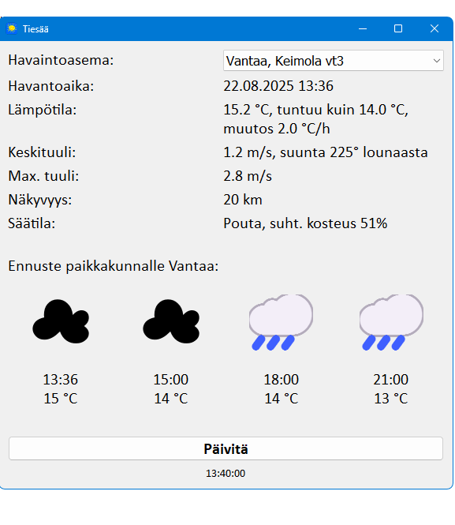

# pyweatherview

Desktop GUI application, which lets the user select a weather station from the list of Finnish road weather stations, and displays the latest data from the selected station, as well as symbols for the current weather and three 3-hour forecasts. Forecast data is fetched from OpenWeather API based on the city name of the selected weather station, or weather station coordinates in case the city is not found from OpenWeather service.



Weather station data is fetched from Digitraffic REST/JSON API (see https://www.digitraffic.fi/en/road-traffic/), and forecasts from OpenWeather API (see https://openweathermap.org/api). OpenWeather API requires use of an API key, which is defined in file ```settings.json```. Before using the application, the used needs to get an API key and store it in settings.json. Without the key the application won't work.

After startup, the applications polls the API in one minute interval, and when it detects a data update, it calculates how long it needs to wait before the next update (plus some slack time). When the waiting period is over, it polls the API again for updated data. This minimizes the number of polls done to the API, which limits the number of available queries for free user accounts.

In order to run the application, Python packages PyQt6, requests and python-dateutil need to be installed, e.g.
```pip install pyqt6, requests, python-dateutil```

#### Known issues
- Waiting period calculation may get confused when a new weather station is selected from the list. This can be solved by clicking the update ("Päivitä") button.

#### Improvement ideas
- Weather symbols could be implemented using some other technique that Segoe UI emoji font.
- Night time weather symbols could be added.
- Localization; now all texts are hard-coded in Finnish.
- For easy installation, the application should be packaged.
